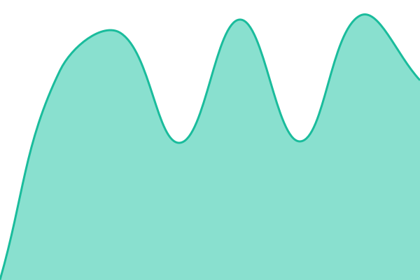

# [📈 Live Status](https://Aclsu.github.io/pof-status): <!--live status--> **🟧 Partial outage**

This repository contains the open-source uptime monitor and status page for [Lucas Bradd](https://Aclsu.github.io/pof-status), powered by [Upptime](https://github.com/upptime/upptime).

With [Upptime](https://upptime.js.org), you can get your own unlimited and free uptime monitor and status page, powered entirely by a GitHub repository. We use [Issues](https://github.com/Aclsu/pof-status/issues) as incident reports, [Actions](https://github.com/Aclsu/pof-status/actions) as uptime monitors, and [Pages](https://Aclsu.github.io/pof-status) for the status page.

<!--start: status pages-->
<!-- This summary is generated by Upptime (https://github.com/upptime/upptime) -->
<!-- Do not edit this manually, your changes will be overwritten -->
<!-- prettier-ignore -->
| URL | Status | History | Response Time | Uptime |
| --- | ------ | ------- | ------------- | ------ |
|  [Phillips Ormonde Fitzpatrick - IPSYS](https://ipsys.com.au/videos/) | 🟩 Up | [phillips-ormonde-fitzpatrick-ipsys.yml](https://github.com/Aclsu/pof-status/commits/HEAD/history/phillips-ormonde-fitzpatrick-ipsys.yml) | 

 970ms
     
 | 

<a href="https://status.pof.com.au/history/phillips-ormonde-fitzpatrick-ipsys">100.00%</a>
    

|  [Phillips Ormonde Fitzpatrick - IPSys](https://ipsys.pof.com.au/) | 🟥 Down | [phillips-ormonde-fitzpatrick-ip-sys.yml](https://github.com/Aclsu/pof-status/commits/HEAD/history/phillips-ormonde-fitzpatrick-ip-sys.yml) | 

 1846ms
     
 | 

<a href="https://status.pof.com.au/history/phillips-ormonde-fitzpatrick-ip-sys">0.00%</a>
    

|  [Phillips Ormonde Fitzpatrick - Website](https://www.pof.com.au) | 🟩 Up | [phillips-ormonde-fitzpatrick-website.yml](https://github.com/Aclsu/pof-status/commits/HEAD/history/phillips-ormonde-fitzpatrick-website.yml) | 

 251ms
     
 | 

<a href="https://status.pof.com.au/history/phillips-ormonde-fitzpatrick-website">100.00%</a>
    

|  [IP Organisers - Website](https://www.iporganisers.com.au) | 🟩 Up | [ip-organisers-website.yml](https://github.com/Aclsu/pof-status/commits/HEAD/history/ip-organisers-website.yml) | 

 905ms
     
 | 

<a href="https://status.pof.com.au/history/ip-organisers-website">100.00%</a>
    

<!--end: status pages-->

[**Visit our status website →**](https://Aclsu.github.io/pof-status)

## 📄 License

- Powered by: [Upptime](https://github.com/upptime/upptime)
- Code: [MIT](./LICENSE) © [Lucas Bradd](https://Aclsu.github.io/pof-status)
- Data in the `./history` directory: [Open Database License](https://opendatacommons.org/licenses/odbl/1-0/)
